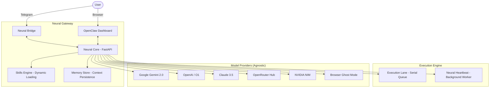

# Ronaldinho Agent 🚀 (OpenClaw Pro Edition)

Ronaldinho is a phenomenal, autonomous engineering AI ecosystem. It is designed to be model-agnostic, self-evolving, and resilient, inspired by the high-performance principles of the **OpenClaw** framework.

---

## 🏗️ System Architecture: The OpenClaw Standard



---

## 🧠 Brain & Abilities

### ⚡ AgentSkills Engine

Ronaldinho can dynamically discover and load new capabilities without restarts.

- **Location**: `.agent/skills/`
- **Native Tools**: Terminal access, File Editing, Python Sandbox.
- **Self-Evolution**: Ronaldinho can create its own skills using the `create_new_skill` tool.

### 🎭 TOON Specialist Personas

The system uses specialized "personas" to tackle different types of missions.

- **Architect, Developer, DevOps, Security, Business...** and 100+ others.
- Automatically detected based on your message intent.

### 🚜 Execution Lane & Memory

- **Lane Queue**: Ensures commands are executed serially per user to prevent file corruption and race conditions.
- **Context Persistence**: Maintains a rolling memory of the last 20 interactions, allowing for complex, multi-turn conversations.

---

## 🚀 Getting Started

### 1. Installation

Ronaldinho comes with a professional CLI for easy management.

```bash
# Clone the repository
git clone [repo-url]
cd ronaldinho-agent

# Install dependencies and setup environment
chmod +x ronaldinho.sh
./ronaldinho.sh install
```

### 2. Management Commands (`./ronaldinho.sh`)

The master script manages the entire ecosystem:

| Command                  | Description                                                 |
| ------------------------ | ----------------------------------------------------------- |
| `./ronaldinho.sh start`  | Launches all services (Core, Bridge, Heartbeat, Dashboard). |
| `./ronaldinho.sh stop`   | Gracefully shuts down all processes.                        |
| `./ronaldinho.sh status` | Checks the health of the Neural Core and Gateway.           |
| `./ronaldinho.sh logs`   | Streams logs from all components.                           |
| `./ronaldinho.sh skills` | Lists all active and discovered skills.                     |

---

## 🖥️ OpenClaw Dashboard

Access the premium control center at `http://localhost:3000`.

- **Real-time Stats**: Track active providers, skill count, and heartbeat status.
- **API Management**: Configure multiple keys (Gemini, Anthropic, OpenAI, etc.) with instant memory propagation.
- **Browser Ghost Setup**: Trigger the manual login window to authorize ChatGPT or Claude sessions.

---

## 🛡️ Resilience & Fallbacks

Ronaldinho features an industry-leading fallback chain via the **API Gateway**:

1. **Primary API** (Gemini/Anthropic/OpenAI)
2. **Rotating Keys** (Auto-failover between different API quotas)
3. **Browser Ghost Mode** (Background Playwright automation)
4. **Antigravity Neural Bridge** (Direct developer handoff)

### 👻 Ghost Mode Setup

If APIs fail, Ronaldinho uses your browser session. To configure:

1. Open the Dashboard -> Integrations.
2. Click **"Configurar Sessão"**.
3. A browser will open. Log in to `chatgpt.com`.
4. Close the browser. Ronaldinho is now authenticated.

---

## 📱 Telegram Integration

Ronaldinho uses Telegram as his primary Neural Bridge for interacting with you on the go.

1. **Create the Bot**: Talk to [@BotFather](https://t.me/botfather) on Telegram and send `/newbot`.
2. **Get the Token**: Choose a name and username for your agent. BotFather will provide an HTTP API Token (e.g., `123456:ABC-DEF1234ghIkl-zyx57W2v1u123ew11`).
3. **Configure**: Add the token to your `.env` file under `TELEGRAM_BOT_TOKEN`, or set it securely via the OpenClaw Dashboard.
4. **Chat**: Open your new bot on Telegram, hit Start, and send your first mission!

---

## 🔑 Environment Variables (.env)

| Variable             | Description                                                            |
| -------------------- | ---------------------------------------------------------------------- |
| `LLM_PROVIDER`       | Default provider (e.g., `gemini`).                                     |
| `MODEL_PRIORITY`     | Custom fallback order (e.g., `gemini,openai,anthropic,local,browser`). |
| `GEMINI_API_KEY`     | Google AI Studio key.                                                  |
| `ANTHROPIC_API_KEY`  | Claude API key.                                                        |
| `OPENROUTER_API_KEY` | OpenRouter access key.                                                 |
| `TELEGRAM_BOT_TOKEN` | Bot key from @BotFather.                                               |

---

## 📂 Project Structure

- `src/core/`: The Neural Core (FastAPI) and Orchestration Logic.
- `src/bridge/`: The Telegram Neural Bridge.
- `src/web/`: The OpenClaw Premium Dashboard.
- `.agent/`: The persistent intelligence layer (Soul, Skills, Team).

---

License: **MIT**
**Fenomenal. Em campo. 🏟️**
