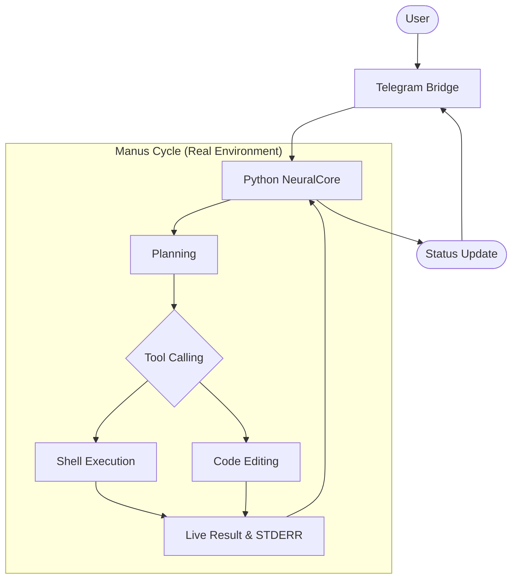
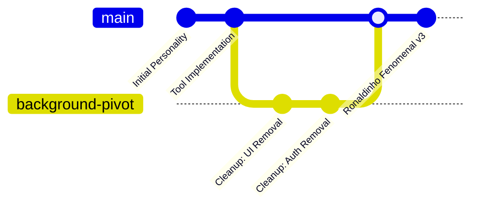

# Ronaldinho-Agent 🚀 (Background Edition)

> [!IMPORTANT]
> **Pure Background Service**: Ronaldinho has pivoted to a 100% background agentic service. Management is performed via Telegram or direct configuration in `.env`. The web-based UI and Keycloak have been removed for maximum efficiency.

Ronaldinho-Agent is an autonomous engineering ecosystem composed of:

- **Python NeuralCore**: The self-evolving brain (FastAPI + PydanticAI).
- **Universal Model Integration**: Dynamic switching between Gemini, NVIDIA, OpenAI, Anthropic, and Groq.
- **Python Bridge**: Telegram integration and event processing.
- **Signaling Server**: P2P coordination and discovery.

## 🧠 Manus Architecture (Cloud Cycle)

Ronaldinho operates on a direct, autonomous loop focused on real environment action.



## 💾 Evolutionary Memory (Git-Backed)

Learning is preserved as versioned commits.



## 🛠️ Quick Local Start

### 1. Prerequisites

- **Python 3.10+**
- **Docker** (optional for background services)

### 2. Configure Environment

Create a `.env` file in the root based on the provided examples.

### 3. Setup and Launch

```bash
# Set up virtual environment and install dependencies
python3 -m venv venv
source venv/bin/activate
pip install -r services/core/requirements.txt python-telegram-bot pydantic-settings pydantic-ai fastapi uvicorn httpx

# Launch Ronaldinho in background
chmod +x start_ronaldinho.sh
./start_ronaldinho.sh
```

## 📂 Repository Structure

```text
.
├── services/
│   ├── core/                # Brain & Manus Tools (FastAPI)
│   └── bridge/              # Telegram Bridge (Python)
├── ronaldinho/              # Soul & Personality
├── logs/                    # Service logs (core.log, bridge.log, etc.)
├── docker-compose.yml       # Simplified Headless Stack
└── start_ronaldinho.sh      # Unified Background Launcher
```

License: **MIT**
