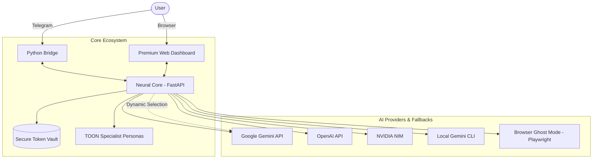

# Ronaldinho-Agent 🚀

Ronaldinho-Agent is a phenomenal autonomous engineering ecosystem, designed for world-class software development, high performance, and self-evolution.

---

## 🏗️ System Architecture



---

## 🧠 Brain & Specialist Personas (TOON)

Ronaldinho doesn't just process text; he embodies specializations. Using the **TOON** system, he dynamically switches identities based on your request:

- **Architect**: High-level structural design.
- **Developer**: Full-stack implementation.
- **Reviewer**: Debugging and code audit.
- **Frontend**: UX/UI mastery.
- **DevOps**: Automation and deployment.

Specialist prompts are located in `.agent/team/*.toon`.

---

## 🛡️ Resilience: Browser Ghost Fallback

When API quotas (Gemini/OpenAI) are exhausted, Ronaldinho activates the **Ghost Mode**. Using Playwright, he interacts directly with AI chat web interfaces as a human operator.

### 🔑 Authentication for Ghost Mode

To use this fallback, you must provide a persistent browser session:

1. Run the login helper:
   ```bash
   chmod +x scripts/browser_login.sh
   ./scripts/browser_login.sh
   ```
2. Log in manually (e.g., ChatGPT) in the window that opens.
3. Close the browser. Ronaldinho will now use this session in the background.

---

## 🚀 Getting Started

### 1. Prerequisites

- **Python 3.10+**
- **Node.js** (for Playwright/CLI fallback)
- **Telegram Bot Token** (via [@BotFather](https://t.me/botfather))

### 2. Quick Start

```bash
# Setup Virtual Environment
python3 -m venv venv
source venv/bin/activate

# Install Dependencies
pip install -r src/core/requirements.txt
python3 -m playwright install chromium

# Launch (Background Mode)
chmod +x start_ronaldinho.sh
./start_ronaldinho.sh
```

---

## 🖥️ Premium Dashboard

Access the glassmorphism dashboard at `http://localhost:3000`.

- **Neural Core**: `http://localhost:5000`
- **Signaling (P2P)**: Port `3001`

---

## 📂 Repository Structure

```text
.
├── .agent/                  # Intelligence Layer
│   ├── soul/                # Identity (SOUL.md) & Knowledge
│   ├── skills/              # Agentic Skills
│   └── team/                # TOON Personas
├── src/
│   ├── core/                # Neural Core (FastAPI)
│   ├── bridge/              # Telegram Bridge
│   └── web/                 # Premium Dashboard
├── scripts/                 # Automation & Maintenance
├── logs_v1/                 # Execution logs
└── start_ronaldinho.sh      # Unified Launcher
```

---

## 🔑 Environment Configuration (.env)

| Variable             | Description                               |
| -------------------- | ----------------------------------------- |
| `LLM_PROVIDER`       | Primary provider (gemini, openai, nvidia) |
| `GEMINI_API_KEY`     | Key for Google AI Studio                  |
| `TELEGRAM_BOT_TOKEN` | Bot token from BotFather                  |
| `PORT`               | Primary Core Port (Default: 5000)         |

---

License: **MIT**
