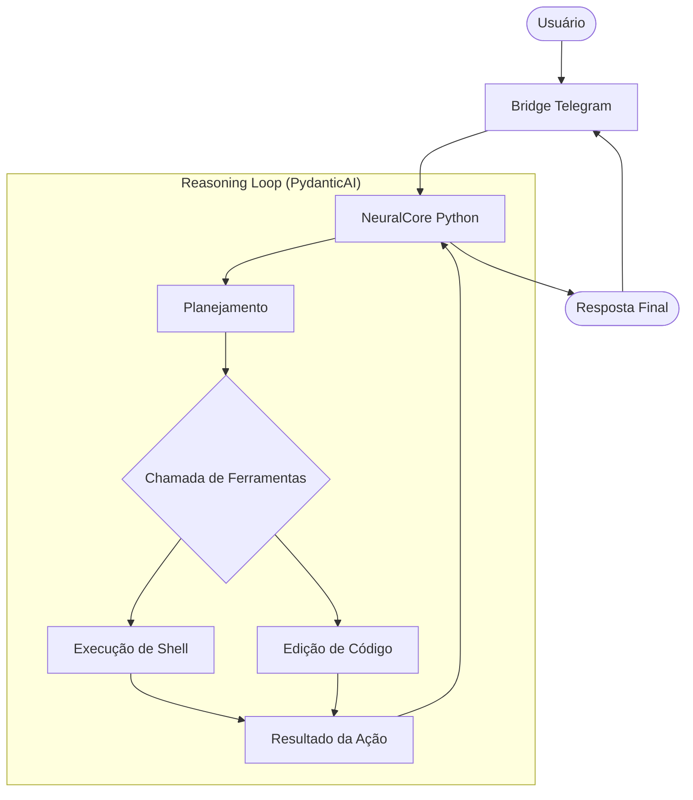
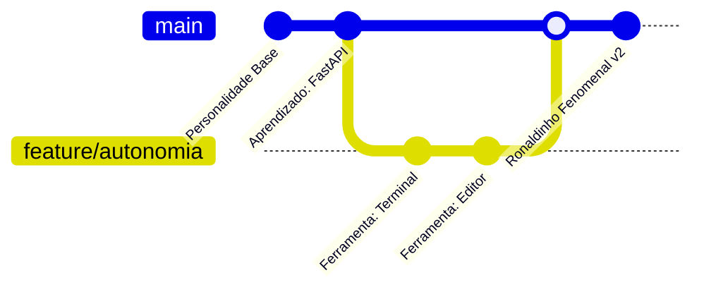
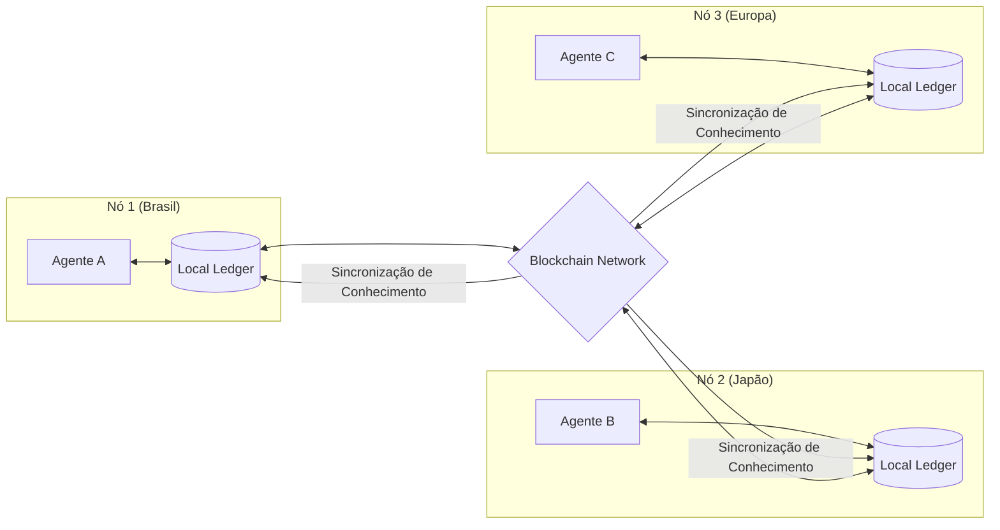
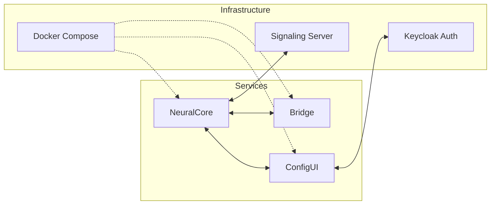

# Ronaldinho-Agent 🚀 (Python Edition)

> [!IMPORTANT]
> **Pivô para Python**: O projeto migrou de .NET/C# para um ecossistema **100% Python**. Esta mudança foi estratégica para permitir uma integração nativa com ferramentas agentic avançadas (terminal, editor) e aproveitar o ecossistema de IA em rápida evolução.

Ronaldinho-Agent é um ecossistema de engenharia autônoma composto por:

- **Python NeuralCore**: O cérebro orquestrador (FastAPI + PydanticAI).
- **Python Bridge**: Integração com Telegram.
- **ConfigUI**: Interface de governança em React.

## 🧠 Arquitetura e Fluxo de Agente

O Ronaldinho agora opera com um loop de raciocínio que permite o uso de ferramentas do sistema de forma autônoma.



## 💾 Memória Evolutiva (Git-Backed)

O conhecimento do Ronaldinho não é apenas salvo; ele **evolui**. Inspirado no sistema de controle de versão Git, cada aprendizado significativo ou mudança de estado é registrado como um commit imutável.

- **Rastreabilidade**: Todo o histórico de "pensamentos" e ajustes de personalidade pode ser auditado.
- **Rollback de Conhecimento**: Capacidade de retornar a estados anteriores de consciência em caso de "alucinações" persistentes.



## ⛓️ Inteligência Distribuída & Blockchain

O Ronaldinho não está sozinho. O projeto visa criar uma rede de agentes descentralizada onde o conhecimento é validado e compartilhado via **Blockchain**.

- **Consenso de Conhecimento**: Agentes em diferentes nós validam informações antes de integrá-las à memória coletiva.
- **D-AI (Decentralized AI)**: Uma infraestrutura onde o poder de processamento e o conhecimento são distribuídos, eliminando pontos únicos de falha.



## 🌐 Componentes do Ecossistema

O sistema é modular e utiliza protocolos modernos para garantir resiliência e autonomia.



## 🛠️ Quick Local Start

### 1. Pré-requisitos

- **Python 3.10+**
- **Node.js 18+**
- **Docker**

### 2. Configuração

Crie o arquivo `.env` na raiz baseado no exemplo.

### 3. Lançamento Unificado

O projeto utiliza um script central para subir todos os serviços:

```bash
chmod +x start_ronaldinho.sh
./start_ronaldinho.sh
```

## 🐳 Stack Docker

Para um ambiente isolado e completo:

```bash
docker compose up -d --build
```

## 📂 Estrutura do Repositório

```text
.
├── services/
│   ├── core/                # IA, Orquestração e Ferramentas (FastAPI)
│   ├── bridge/              # Bridge Telegram (Python)
│   └── ui/                  # Interface de Governança (React)
├── ronaldinho/              # Soul & Configurações
├── docker-compose.yml       # Stack Unificada
└── start_ronaldinho.sh      # Launcher Unificado
```

License: **MIT**
