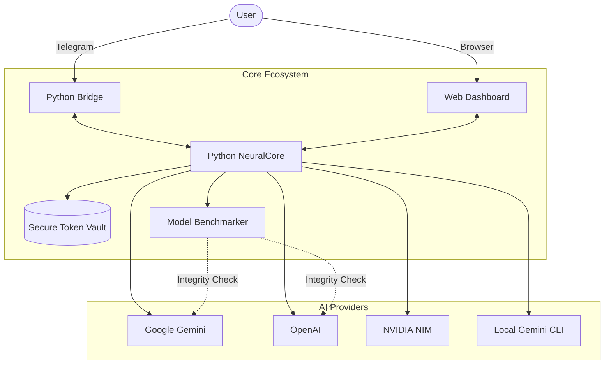
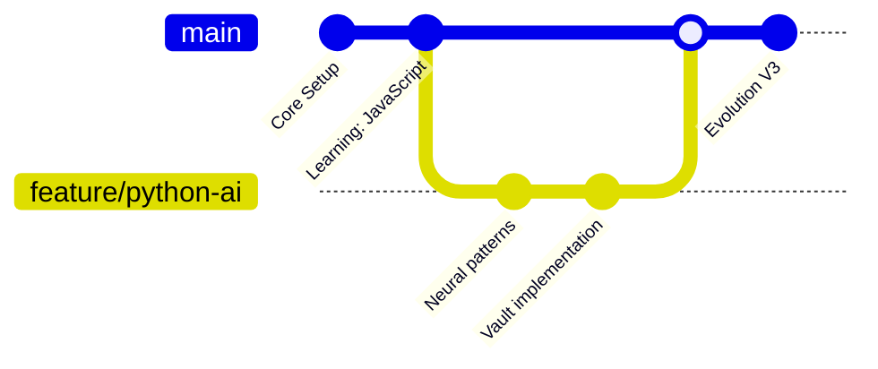
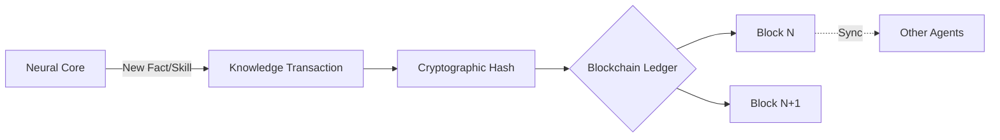
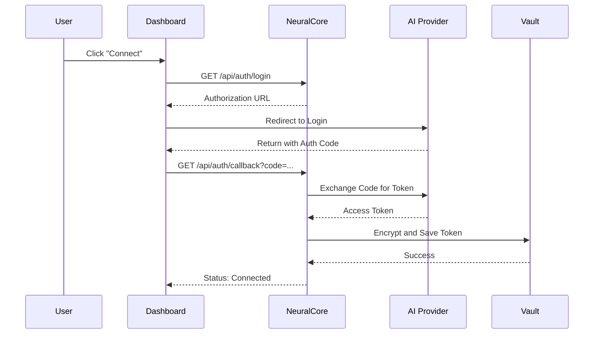
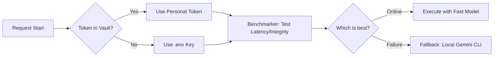

# Ronaldinho-Agent 🚀

Ronaldinho-Agent is an autonomous engineering ecosystem designed for high performance and self-evolution.

---

## 🏗️ System Architecture



---

## � Evolutionary Memory & Decentralized Knowledge

Ronaldinho maintains a self-improving memory system that combines local versioning with decentralized verification.

### 1. Git-Based Memory Diffs

All internal state changes, learned skills, and project modifications are tracked as versioned commits. This allows the agent to "rewind" its state or branch out into different knowledge paths.



### 2. Blockchain Knowledge Ledger

To ensure knowledge integrity and cross-agent synchronization, Ronaldinho anchors "Knowledge Transactions" to a decentralized ledger. This prevents data tampering and enables a shared source of truth for autonomous agents.



---

## �🛠️ Getting Started

### 1. Prerequisites

- **Python 3.10+**
- **Docker & Docker Compose** (optional)
- **Telegram Bot Token** (obtained via [@BotFather](https://t.me/botfather))

### 2. Environment Configuration

Create a `.env` file in the root directory (use `.env.example` as a template):

```bash
cp .env.example .env
```

### 3. Local Execution (Quick Start)

```bash
python3 -m venv venv
source venv/bin/activate
pip install -r services/core/requirements.txt
chmod +x start_ronaldinho.sh
./start_ronaldinho.sh
```

---

## 🖥️ Web Dashboard & OAuth2 Flow

Ronaldinho uses a modern authentication flow to manage your AI credentials securely.

### Connection Flow



---

## 🧠 Intelligence and Resilience

### Model Selection (Integrity Logic)

Ronaldinho doesn't just "ping" providers; it tests the functional capability of each model before selecting it.



---

## 📂 Repository Structure

```text
.
├── services/
│   ├── core/                # Brain & Manus Tools (FastAPI)
│   ├── bridge/              # Telegram Bridge (Python)
│   └── web/                 # Dashboard Web (OIDC/OAuth2)
├── ronaldinho/              # Soul & Secure Vault
├── logs_v1/                 # Execution logs
└── start_ronaldinho.sh      # Unified Launcher
```

---

## 🔑 OAuth2 Setup (Dashboard)

To use the Dashboard's "Connect" buttons, you must provide your own OAuth2 credentials:

1. **Google Gemini**:
   - Go to [Google Cloud Console](https://console.cloud.google.com/).
   - Create a project and enable the **Generative Language API**.
   - Create an **OAuth 2.0 Client ID** (Web Application).
   - Add `http://localhost:3000/index.html` to **Authorized redirect URIs**.
   - Copy the Client ID and Secret to your `.env`.

2. **Configuration**:
   Add these to your `.env`:
   ```bash
   GOOGLE_CLIENT_ID=your-id.apps.googleusercontent.com
   GOOGLE_CLIENT_SECRET=your-secret
   ```

License: **MIT**
