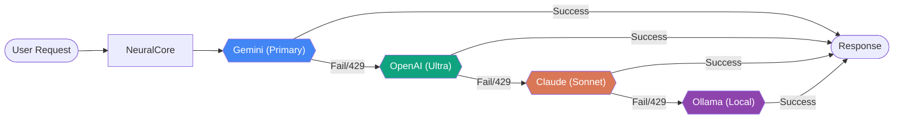
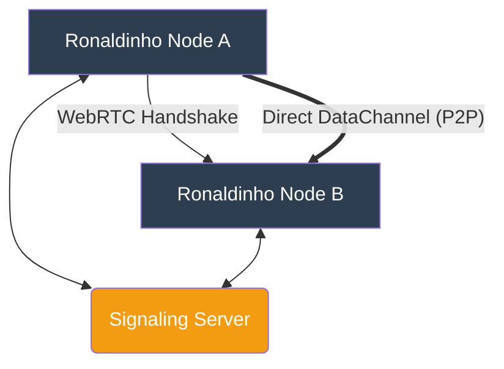
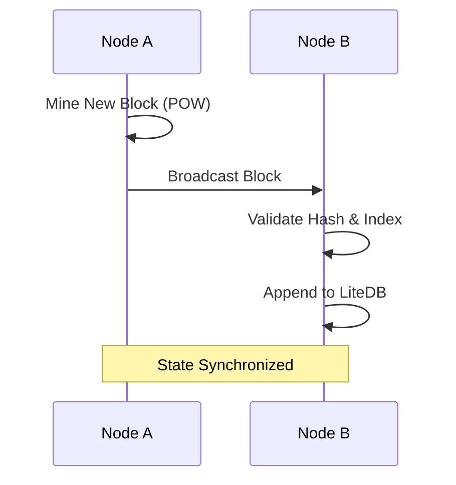
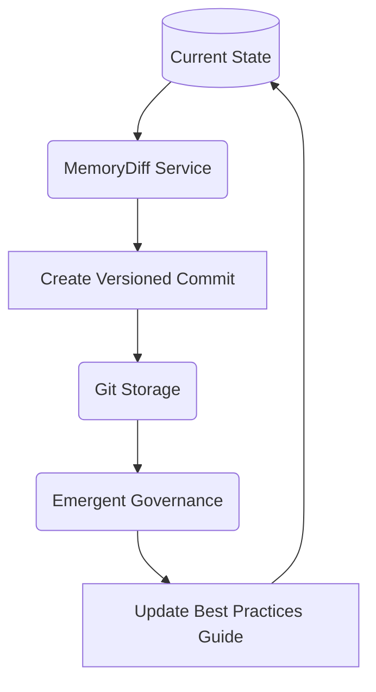

# Ronaldinho-Agent 🚀 (Open Source Edition)

> [!IMPORTANT]
> **Codename disclaimer**: "Ronaldinho-Agent" is currently a project codename and not a final product brand.

- [Portuguese (PT-BR)](README_pt-br.md)
- [Japanese (JA)](README_ja.md)

Ronaldinho-Agent is an autonomous engineering ecosystem composed of:

- a **.NET 9 NeuralCore** API/orchestrator,
- a **.NET Bridge worker** for Telegram integration,
- a **React + Vite + Chakra UI ConfigUI**,
- and **Keycloak + Postgres** for OIDC authentication.

This README is the primary (English) project guide for understanding, running, and developing the platform.

---

## Table of Contents

- [1. Architecture](#1-architecture)
- [2. Core Systems & Mechanisms](#2-core-systems-mechanisms)
- [3. Repository structure](#3-repository-structure)
- [4. Prerequisites](#4-prerequisites)
- [5. Environment variables (`.env`)](#5-environment-variables-env)
- [5. Run modes](#5-run-modes)
  - [5.1 Quick local start](#51-quick-local-start)
  - [5.2 Service-by-service local run](#52-service-by-service-local-run)
  - [5.3 Full stack with Docker](#53-full-stack-with-docker)
- [6. API and authentication](#6-api-and-authentication)
- [7. Development workflow](#7-development-workflow)
- [8. Utility scripts](#8-utility-scripts)
- [9. Security notes](#9-security-notes)
- [10. Troubleshooting](#10-troubleshooting)
- [11. Additional docs](#11-additional-docs)
- [12. Contributing and license](#12-contributing-and-license)

---

## 1. Architecture

### Core components

1. **NeuralCore** (`services/Ronaldinho.NeuralCore`)
   - Main API/orchestration runtime (`http://localhost:5000`).
   - Loads root `.env` and local vault values.
   - Protects settings endpoints with JWT/OIDC.

2. **Bridge** (`services/Ronaldinho.Bridge`)
   - Telegram integration worker.
   - Reads Telegram token from local secrets or environment.
   - **Recent behavior**: if no token is present, Bridge still starts safely and skips Telegram polling job registration.

3. **ConfigUI** (`services/Ronaldinho.ConfigUI`)
   - Frontend governance interface (`http://localhost:5173` in dev).
   - OIDC login against Keycloak.
   - **Recent behavior**: settings fetch runs only after authentication; API errors are no longer silently replaced with fake/mock success.

4. **Keycloak + Postgres** (docker-compose)
   - Identity provider and persistence layer for auth.

---

## 2. Core Systems & Mechanisms

Ronaldinho-Agent is powered by a suite of specialized systems designed for autonomy, resilience, and decentralized intelligence.

### 🧠 NeuralCore & LLM Orchestration

- **Semantic Kernel Foundation**: Uses Microsoft's Semantic Kernel to orchestrate complex AI workflows and multi-agent coordination.
- **Zero-Block Resilience**: A sophisticated fallback mechanism that automatically rotates between providers (Gemini ➔ OpenAI ➔ Claude ➔ Ollama) upon encountering rate limits (429) or failures.



- **MCP Protocol**: Implements the Model Context Protocol for seamless integration of specialized agent skills and external tools.

### 🌐 P2P Mesh Networking

- **WebRTC DataChannels**: Secure, direct, and lag-free communication between Ronaldinho nodes without relying on a central server.
- **Autonomous Discovery**: Uses a lightweight signaling server for initial handshakes, after which peers communicate directly.



- **Decentralized Coordination**: Enables multiple agents to share context and tasks over a distributed mesh.

### ⛓️ Knowledge Blockchain

- **Distributed Ledger**: A proof-of-work based blockchain (`Ronaldinho.Blockchain`) that stores knowledge transactions and system decisions.
- **State Consistency**: Ensures all nodes in the mesh have a synchronized and immutable history of the agent's "thoughts" and actions.



- **LiteDB Persistence**: Efficient local storage of the ledger for fast retrieval and auditing.

### 💾 Memory & Evolution (Git-Backed)

- **Git-Backed Memory**: Persists the agent's evolutionary state as a series of versioned commits, ensuring total traceability.
- **MemoryDiff Service**: Utilizes JSON-Patch (RFC 6902) to calculate precise diffs between knowledge states, optimizing storage and making history searchable.



- **Emergent Governance**: An autonomous system that analyzes contribution patterns in the codebase and automatically updates best practices guides (`docs/emergent_best_practices.md`).

### 🛡️ SecurityGuard

- **Zero-Trust Security**: Local-first philosophy where sensitive data is encrypted at rest and never leaves the environment unencrypted.
- **AES-256 KeyVault**: Industry-standard symmetric encryption for API keys and secrets.
- **PII Scrubber**: Automated regex-based redaction system that cleanses logs of emails, credit cards, and secrets before they are written to disk.

---

## 3. Repository structure

```text
.
├── services/
│   ├── Ronaldinho.NeuralCore/   # .NET 9 core API and orchestration
│   ├── Ronaldinho.Bridge/       # .NET 9 Telegram bridge worker
│   └── Ronaldinho.ConfigUI/     # React/Vite governance UI
├── ronaldinho/
│   ├── config/                  # SOUL.md and runtime configs
│   └── data/                    # local vault and runtime data
├── dev_scripts/                 # local helper scripts
├── scripts/                     # Keycloak and IdP helper scripts
├── docs/                        # architecture/security/roadmap docs
├── docker-compose.yml           # development stack
├── docker-compose.prod.yml      # production stack
├── README.md                    # primary docs (English)
├── README_pt-br.md              # Portuguese docs
└── README_ja.md                 # Japanese docs
```

---

## 3. Prerequisites

### Local development

- **.NET SDK 9.0**
- **Node.js 18+** (npm)
- **PowerShell 7+** (for `.ps1` scripts)
- **Git**

### Containerized stack

- **Docker**
- **Docker Compose**

---

## 4. Environment variables (`.env`)

> [!WARNING]
> The repository currently does **not** include a `.env.example`; create `.env` manually at the repository root.

Suggested baseline:

```env
# LLM + Telegram
GEMINI_API_KEY=
OPENAI_API_KEY=
ANTHROPIC_API_KEY=
TELEGRAM_BOT_TOKEN=
LLM_PROVIDER=gemini
ENABLE_AUTO_FALLBACK=true
ALLOW_LOCAL_TOOLS=false

# Auth (Keycloak / OIDC)
AUTH_AUTHORITY=http://localhost:8080/realms/ronaldinho
AUTH_AUDIENCE=account

# ConfigUI (Vite)
VITE_AUTH_AUTHORITY=http://localhost:8080/realms/ronaldinho
VITE_AUTH_CLIENT_ID=configui-client
VITE_AUTH_REDIRECT_URI=http://localhost:5173
VITE_API_BASE_URL=http://localhost:5000/api

# Keycloak DB / admin (docker-compose)
DB_NAME=keycloak
DB_USER=keycloak
DB_PASSWORD=password
KEYCLOAK_ADMIN=admin
KEYCLOAK_ADMIN_PASSWORD=admin
KC_HOSTNAME=localhost
```

Notes:

- NeuralCore can start without `TELEGRAM_BOT_TOKEN` to allow initial setup via ConfigUI.
- Bridge now safely avoids scheduling Telegram polling when no token is configured.
- OpenAI integration is now optional at startup: when `OPENAI_API_KEY` is missing, the ResearcherAgent is kept offline and the API still boots.
- Never commit real secrets.

---

## 5. Run modes

### 5.1 Quick local start

### Linux/macOS

```bash
chmod +x start_neural.sh ./dev_scripts/*.sh
./start_neural.sh
```

### Windows (PowerShell)

```powershell
./start_neural.ps1
```

### 5.2 Service-by-service local run

### Terminal 1 — NeuralCore

```bash
dotnet run --project services/Ronaldinho.NeuralCore/Ronaldinho.NeuralCore.csproj
```

### Terminal 2 — Bridge (optional)

```bash
dotnet run --project services/Ronaldinho.Bridge/Ronaldinho.Bridge.csproj
```

### Terminal 3 — ConfigUI

```bash
cd services/Ronaldinho.ConfigUI
npm install
npm run dev
```

Local endpoints:

- NeuralCore API: `http://localhost:5000`
- ConfigUI: `http://localhost:5173`
- Keycloak: `http://localhost:8080`

### 5.3 Full stack with Docker

```bash
docker compose up -d --build --remove-orphans
```

Production compose:

```bash
docker compose -f docker-compose.prod.yml up -d --build
```

---

## 6. API and authentication

Main protected routes in NeuralCore:

- `GET /api/settings`
- `POST /api/settings`

OIDC/JWT settings are controlled by:

- `AUTH_AUTHORITY`
- `AUTH_AUDIENCE`
- `VITE_AUTH_AUTHORITY`
- `VITE_AUTH_CLIENT_ID`
- `VITE_AUTH_REDIRECT_URI`

---

## 7. Development workflow

Recommended local checks:

```bash
# Backend
dotnet build services/Ronaldinho.NeuralCore/Ronaldinho.NeuralCore.csproj
dotnet build services/Ronaldinho.Bridge/Ronaldinho.Bridge.csproj

# Frontend
cd services/Ronaldinho.ConfigUI
npm run lint
npm run build
```

Workflow:

1. Create a feature/fix branch.
2. Keep commits focused.
3. Run checks locally.
4. Open PR with clear impact and validation notes.

---

## 8. Test Proofs & Validation

Ronaldinho-Agent capability is verified through a rigorous combination of unit, integration, and functional smoke tests.

### 8.1 Automated Smoke Tests

We use a unified `smoke_test.sh` to verify the "Phenomenal" capabilities of the NeuralCore in real-time.

| Capability            | Status  | Proof Marker (Logs)                        |
| :-------------------- | :------ | :----------------------------------------- |
| **P2P Networking**    | ✅ PASS | `info: Ronaldinho.P2P.P2PGateway`          |
| **Blockchain Sync**   | ✅ PASS | `info: Ronaldinho.Blockchain.Chain`        |
| **MCP Orchestration** | ✅ PASS | `[MCP] Booting CodeSpecialistAgent`        |
| **LLM Resilience**    | ✅ PASS | `[GeminiStrategy] Resilience Layer Active` |
| **Memory Diffing**    | ✅ PASS | `ronaldinho/data/memorydiff/commits`       |
| **KeyVault (AES)**    | ✅ PASS | `[System] Environment loaded`              |

### 8.2 Proof of Handshake (P2P)

Real-world decentralization is proven by the successful WebRTC DataChannel opening between independent instances:

```text
info: Ronaldinho.P2P.PeerNode[0]
      Received offer from peer. Creating answer...
info: Ronaldinho.P2P.PeerNode[0]
      DataChannel opened with peer-a
```

### 8.3 Manual Verification

To run the capability proofs yourself:

```bash
# Full P2P Handshake Proof
./test_p2p.sh

# Complete Capability Smoke Test
./smoke_test.sh
```

---

## 9. Utility scripts

`dev_scripts/` includes helper scripts for startup, local UI launch, and operational utilities.

`scripts/` includes Keycloak setup helpers:

- `setup_keycloak.sh`
- `add_google_idp.sh`
- `add_github_idp.sh`

> [!NOTE]
> Review script defaults before production use.

---

## 9. Security notes

- Do not commit `.env`, API keys, tokens, or sensitive logs.
- Review `SECURITY.md` and `docs/security_model.md`.
- Sanitize screenshots/log excerpts before sharing.

---

## 10. Troubleshooting

### `dotnet: command not found`

Install .NET 9 SDK and verify:

```bash
dotnet --version
```

### ConfigUI authentication issues

Verify Keycloak realm/client and all `AUTH_*` / `VITE_AUTH_*` variables.

### Docker container name conflict (`/ronaldinho_configui` or `/ronaldinho_config_ui` already in use)

This usually means you still have legacy containers created when fixed `container_name` values were used. Remove them and start again:

```bash
./dev_scripts/fix_docker_container_conflicts.sh
docker compose up -d --build --remove-orphans
```

### Bridge not sending Telegram messages

Check `TELEGRAM_BOT_TOKEN` and token source in local secrets/environment.

### Frontend lint/install conflicts

Use a clean install (`rm -rf node_modules package-lock.json && npm install`) and validate package versions.

---

## 11. Additional docs

- `docs/architecture.md`
- `docs/security_model.md`
- `docs/mission_lifecycle.md`
- `docs/integration_roadmap.md`
- `CONTRIBUTING.md`

---

## 12. Contributing and license

Contributions are welcome.

Read before contributing:

- `CONTRIBUTING.md`
- `SECURITY.md`

License: **MIT** (`LICENSE`).
