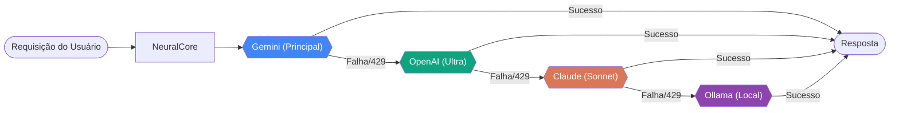
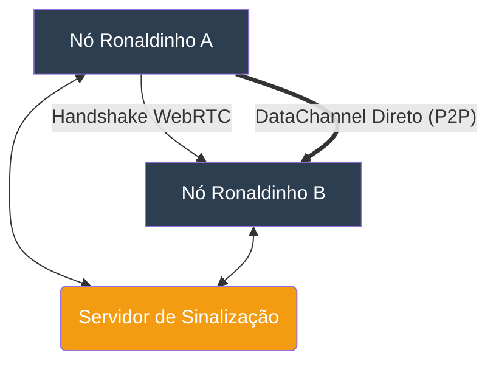
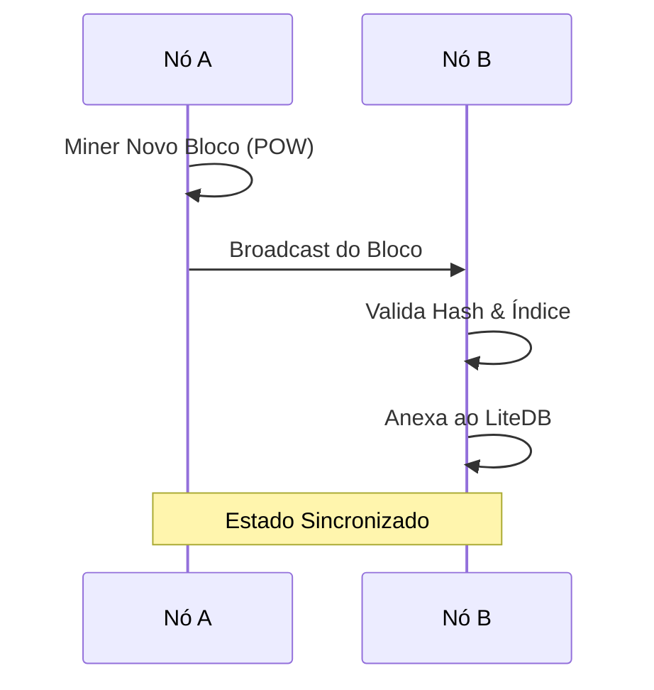
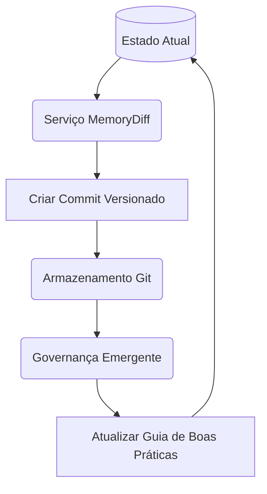

# Ronaldinho-Agent 🚀 (Edição Open Source)

> [!IMPORTANT]
> **Aviso de codinome**: "Ronaldinho-Agent" é um codinome de projeto e não representa a marca final do produto.

- [English (EN)](README.md)
- [日本語 (JA)](README_ja.md)

O Ronaldinho-Agent é um ecossistema de engenharia autônoma composto por:

- **NeuralCore em .NET 9** (API e orquestração),
- **Bridge em .NET** para integração Telegram,
- **ConfigUI em React + Vite + Chakra UI**,
- **Keycloak + Postgres** para autenticação OIDC.

Este README em PT-BR é o guia para entender, executar e desenvolver o projeto.

---

## Sumário

- [1. Arquitetura](#1-arquitetura)
- [2. Sistemas e Mecanismos Nucleares](#2-sistemas-e-mecanismos-nucleares)
- [3. Estrutura do repositório](#2-estrutura-do-repositório)
- [4. Pré-requisitos](#3-pré-requisitos)
- [5. Variáveis de ambiente (`.env`)](#4-variáveis-de-ambiente-env)
- [5. Modos de execução](#5-modos-de-execução)
- [6. API e autenticação](#6-api-e-autenticação)
- [7. Fluxo de desenvolvimento](#7-fluxo-de-desenvolvimento)
- [8. Scripts utilitários](#8-scripts-utilitários)
- [9. Segurança](#9-segurança)
- [10. Troubleshooting](#10-troubleshooting)
- [11. Documentação adicional](#11-documentação-adicional)
- [12. Contribuição e licença](#12-contribuição-e-licença)

---

## 1. Arquitetura

### Componentes principais

1. **NeuralCore** (`services/Ronaldinho.NeuralCore`)
   - Runtime principal da API/orquestração (`http://localhost:5000`).
   - Carrega `.env` da raiz e valores de vault local.
   - Protege endpoints de settings com JWT/OIDC.

2. **Bridge** (`services/Ronaldinho.Bridge`)
   - Worker de integração com Telegram.
   - Lê token do Telegram de secret local ou variável de ambiente.
   - **Comportamento recente**: sem token, o Bridge sobe com segurança e não agenda polling do Telegram.

3. **ConfigUI** (`services/Ronaldinho.ConfigUI`)
   - Interface de governança (`http://localhost:5173` em dev).
   - Login OIDC via Keycloak.
   - **Comportamento recente**: busca settings só após autenticação e não mascara mais erros de API com fallback falso.

4. **Keycloak + Postgres** (docker-compose)
   - Camada de identidade e persistência de autenticação.

---

## 2. Sistemas e Mecanismos Nucleares

O Ronaldinho-Agent é impulsionado por uma suíte de sistemas especializados projetados para autonomia, resiliência e inteligência descentralizada.

### 🧠 NeuralCore & Orquestração de LLM

- **Base em Semantic Kernel**: Utiliza o Semantic Kernel da Microsoft para orquestrar fluxos de trabalho de IA complexos e coordenação multi-agente.
- **Resiliência Zero-Block**: Um mecanismo sofisticado de fallback que rotaciona automaticamente entre provedores (Gemini ➔ OpenAI ➔ Claude ➔ Ollama) ao encontrar limites de taxa (429) ou falhas.



- **Protocolo MCP**: Implementa o Model Context Protocol para integração fluida de habilidades especializadas de agentes e ferramentas externas.

### 🌐 Rede Mesh P2P

- **WebRTC DataChannels**: Comunicação segura, direta e sem latência entre nós do Ronaldinho sem depender de um servidor central.
- **Descoberta Autônoma**: Utiliza um servidor de sinalização leve para o handshake inicial, após o qual os pares se comunicam diretamente.



- **Coordenação Descentralizada**: Permite que múltiplos agentes compartilhem contexto e tarefas em uma malha distribuída.

### ⛓️ Blockchain de Conhecimento

- **Ledger Distribuído**: Uma blockchain baseada em proof-of-work (`Ronaldinho.Blockchain`) que armazena transações de conhecimento e decisões do sistema.
- **Consistência de Estado**: Garante que todos os nós na rede tenham um histórico sincronizado e imutável das ações e "pensamentos" do agente.



- **Persistência LiteDB**: Armazenamento local eficiente do ledger para recuperação rápida e auditoria.

### 💾 Memória & Evolução (Baseada em Git)

- **Memória Baseada em Git**: Persiste o estado evolutivo do agente como uma série de commits versionados, garantindo rastreabilidade total.
- **Serviço MemoryDiff**: Utiliza JSON-Patch (RFC 6902) para calcular diffs precisos entre estados de conhecimento, otimizando o armazenamento e tornando o histórico pesquisável.



- **Governança Emergente**: Um sistema autônomo que analisa padrões de contribuição no código e atualiza automaticamente os guias de melhores práticas (`docs/emergent_best_practices.md`).

### 🛡️ SecurityGuard

- **Segurança Zero-Trust**: Filosofia local-first onde dados sensíveis são criptografados em repouso e nunca saem do ambiente sem proteção.
- **KeyVault AES-256**: Criptografia simétrica padrão de mercado para chaves de API e segredos.
- **PII Scrubber**: Sistema automatizado baseado em regex que limpa logs de e-mails, cartões de crédito e segredos antes de serem gravados em disco.

---

## 3. Estrutura do repositório

```text
.
├── services/
│   ├── Ronaldinho.NeuralCore/   # API e orquestração .NET 9
│   ├── Ronaldinho.Bridge/       # Worker Telegram .NET 9
│   └── Ronaldinho.ConfigUI/     # UI de governança React/Vite
├── ronaldinho/
│   ├── config/                  # SOUL.md e configs
│   └── data/                    # vault local e dados de runtime
├── dev_scripts/                 # scripts auxiliares de ambiente local
├── scripts/                     # scripts para Keycloak/IdP
├── docs/                        # documentação técnica
├── docker-compose.yml           # stack de desenvolvimento
├── docker-compose.prod.yml      # stack de produção
├── README.md                    # documentação principal (EN)
├── README_pt-br.md              # documentação PT-BR
└── README_ja.md                 # documentação JA
```

---

## 3. Pré-requisitos

### Desenvolvimento local

- **.NET SDK 9.0**
- **Node.js 18+** (npm)
- **PowerShell 7+** (scripts `.ps1`)
- **Git**

### Stack em containers

- **Docker**
- **Docker Compose**

---

## 4. Variáveis de ambiente (`.env`)

> [!WARNING]
> O repositório atualmente **não** possui `.env.example`; crie manualmente um `.env` na raiz.

Exemplo base:

```env
# LLM + Telegram
GEMINI_API_KEY=
OPENAI_API_KEY=
ANTHROPIC_API_KEY=
TELEGRAM_BOT_TOKEN=
LLM_PROVIDER=gemini
ENABLE_AUTO_FALLBACK=true
ALLOW_LOCAL_TOOLS=false

# Auth (Keycloak / OIDC)
AUTH_AUTHORITY=http://localhost:8080/realms/ronaldinho
AUTH_AUDIENCE=account

# ConfigUI (Vite)
VITE_AUTH_AUTHORITY=http://localhost:8080/realms/ronaldinho
VITE_AUTH_CLIENT_ID=configui-client
VITE_AUTH_REDIRECT_URI=http://localhost:5173
VITE_API_BASE_URL=http://localhost:5000/api

# Keycloak DB / admin
DB_NAME=keycloak
DB_USER=keycloak
DB_PASSWORD=password
KEYCLOAK_ADMIN=admin
KEYCLOAK_ADMIN_PASSWORD=admin
KC_HOSTNAME=localhost
```

Notas:

- O NeuralCore pode subir sem `TELEGRAM_BOT_TOKEN` para setup inicial.
- O Bridge agora evita agendar polling quando não há token configurado.
- Nunca commite segredos reais.

---

## 5. Modos de execução

### 5.1 Inicialização Total (Recomendado)

O projeto agora está totalmente configurado para rodar com um único comando via Docker:

```bash
docker compose up -d --build
```

Isso subirá:

- **NeuralCore** (Backend) em `https://localhost:5000`
- **Bridge** (Telegram Worker)
- **ConfigUI** (Frontend) em `http://localhost:5173`
- **Keycloak** (Identidade) em `http://localhost:8080`
- **Postgres** (Banco de dados)

Para ver os logs de todos os serviços:

```bash
docker compose logs -f
```

### 5.2 Execução por serviço

NeuralCore:

```bash
dotnet run --project services/Ronaldinho.NeuralCore/Ronaldinho.NeuralCore.csproj
```

Bridge (opcional):

```bash
dotnet run --project services/Ronaldinho.Bridge/Ronaldinho.Bridge.csproj
```

ConfigUI:

```bash
cd services/Ronaldinho.ConfigUI
npm install
npm run dev
```

### 5.3 Full stack com Docker

```bash
docker compose up -d --build
```

Produção:

```bash
docker compose -f docker-compose.prod.yml up -d --build
```

---

## 6. API e autenticação

Rotas protegidas principais:

- `GET /api/settings`
- `POST /api/settings`

Variáveis-chave de autenticação:

- `AUTH_AUTHORITY`
- `AUTH_AUDIENCE`
- `VITE_AUTH_AUTHORITY`
- `VITE_AUTH_CLIENT_ID`
- `VITE_AUTH_REDIRECT_URI`

---

## 7. Fluxo de desenvolvimento

Checks recomendados:

```bash
# Backend
dotnet build services/Ronaldinho.NeuralCore/Ronaldinho.NeuralCore.csproj
dotnet build services/Ronaldinho.Bridge/Ronaldinho.Bridge.csproj

# Frontend
cd services/Ronaldinho.ConfigUI
npm run lint
npm run build
```

---

## 8. Scripts utilitários

- `dev_scripts/`: inicialização e rotinas locais.
- `scripts/`: setup de Keycloak e IdPs (`setup_keycloak.sh`, `add_google_idp.sh`, `add_github_idp.sh`).

---

## 9. Segurança

- Não versione `.env`, tokens, chaves e logs sensíveis.
- Leia `SECURITY.md` e `docs/security_model.md`.

---

## 10. Troubleshooting

### `dotnet: command not found`

Instale .NET 9 SDK e valide:

```bash
dotnet --version
```

### Problemas de autenticação na ConfigUI

Valide realm/client no Keycloak e variáveis `AUTH_*`/`VITE_AUTH_*`.

### Bridge sem resposta no Telegram

Valide `TELEGRAM_BOT_TOKEN` e fonte do token (secrets/env).

---

## 11. Documentação adicional

- `docs/architecture.md`
- `docs/security_model.md`
- `docs/mission_lifecycle.md`
- `docs/integration_roadmap.md`
- `CONTRIBUTING.md`

---

## 12. Contribuição e licença

Contribuições são bem-vindas.

Leia antes de contribuir:

- `CONTRIBUTING.md`
- `SECURITY.md`

Licença: **MIT** (`LICENSE`).
