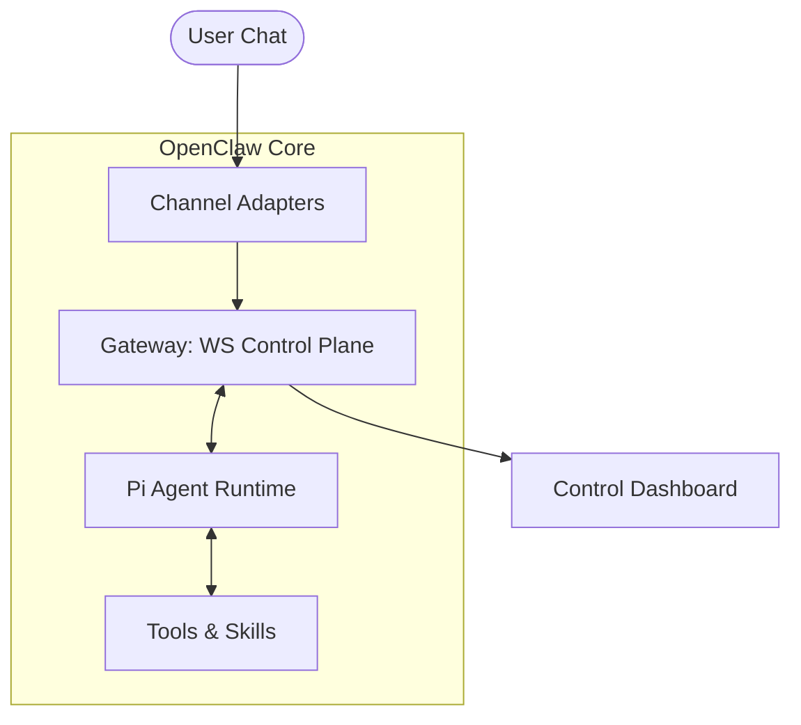

# 🦞 OpenClaw: Analysis of Functionalities & Implementation

OpenClaw is a highly modular, open-source personal AI assistant designed to run locally while providing access across multiple messaging platforms. This document breaks down its core features and how they are structurally implemented.

## 🏗️ Architectural Overview

OpenClaw follows a **Gateway-Agent-Channel** architecture, primarily implemented in **Node.js/TypeScript**.

---

## 🛠️ Core Functionalities & Implementation

### 1. Gateway Control Plane

- **Functionality**: Manages the life cycle of the assistant, session state, and routes messages between the AI and external channels.
- **Implementation**: Located in `src/gateway`. It uses **WebSockets** for real-time communication. The `server.ts` file orchestrates the state, presence, and session pruning logic.

### 2. Multi-Channel Messaging

- **Functionality**: Connects to WhatsApp, Telegram, Slack, etc., allowing the same assistant personality to be used everywhere.
- **Implementation**: Found in `src/channels`. It uses specific libraries for each platform:
  - **WhatsApp**: `Baileys`
  - **Telegram**: `grammY`
  - **Discord**: `discord.js`
  - **Slack**: `Bolt`
    Adapters translate platform-specific objects into standardized OpenClaw events.

### 3. Pi Agent Runtime

- **Functionality**: The "brain" that processes user input, decides on tool use, and manages conversation streaming.
- **Implementation**: Resides in `src/agents/piembeddedrunner.ts`. It acts as a wrapper around the Pi Agent Core, handling LLM responses and streaming tool-output blocks back to the user.

### 4. Evolutionary Memory

- **Functionality**: Ronaldinho-style persistent context using Markdown files for "Soul" and "Knowledge".
- **Implementation**: Stores data in `~/.openclaw/`. Key files include:
  - `SOUL.md`: Personality and core directives.
  - `AGENTS.md`: Technical roles and capabilities.
  - `TOOLS.md`: Documented tool schemas for LLM injection.

### 5. Tool Integration & Browser Control

- **Functionality**: Real-world action via terminal execution and automated browser navigation.
- **Implementation**:
  - **Browser**: Managed Chrome/Chromium via CDP (Chrome DevTools Protocol) in `src/tools/browser.ts`.
  - **Terminal**: Direct shell execution on the host machine.

### 6. Security & Sandboxing

- **Functionality**: Prevents malicious tool use in group chats or untrusted environments.
- **Implementation**: Implemented via **Docker**. Non-main sessions (groups) are routed to a `per-session Docker sandbox`, restricting the agent's access to the host filesystem.

---

## 📈 Comparison with Ronaldinho-Agent

| Feature       | OpenClaw Implementation         | Ronaldinho Implementation       |
| :------------ | :------------------------------ | :------------------------------ |
| **Language**  | Node.js / TypeScript            | Python (NeuralCore)             |
| **Messaging** | Multi-channel adapters          | Telegram Bridge (fastapi-based) |
| **Logic**     | Pi RPC Agent                    | PydanticAI (Manus Architecture) |
| **Memory**    | Markdown files in `~/.openclaw` | Git-backed Evolutionary Memory  |
| **Discovery** | Tailscale / WebSocket           | Signaling Server (P2P)          |

---

## 🏁 Conclusion

OpenClaw is a robust example of a **headless agentic service** that abstracts complex channel complexity away from the AI core. Its implementation focuses on **event-driven modularity**, making it easy to add new skills (tools) or channels without touching the central agent runtime.
