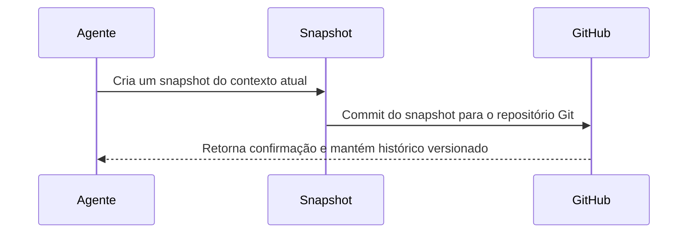

# Gestão de Memória Versionada para Agentes de IA

## Visão Geral

A ideia é criar um sistema onde os agentes de IA possam versionar suas memórias usando o Git. Cada "snapshot" do contexto é armazenado como um commit, criando um histórico versionado que o agente pode consultar no futuro.

## Fluxo do Sistema

## Componentes Principais

* **Agente**: O agente de IA que está executando as tarefas e deseja manter o contexto.
* **Snapshot**: Um ponto de salvamento do contexto atual, que inclui dados relevantes.
* **GitHub (ou outro repositório Git)**: O repositório onde os snapshots são versionados e armazenados de forma segura.

## Benefícios

* **Memória Persistente**: O agente pode recuperar contextos antigos sem perder informações.
* **Histórico Versionado**: Cada alteração é registrada, permitindo rastreabilidade.
* **Otimização**: Menos reprocessamento de dados, economizando tokens e requisições.
