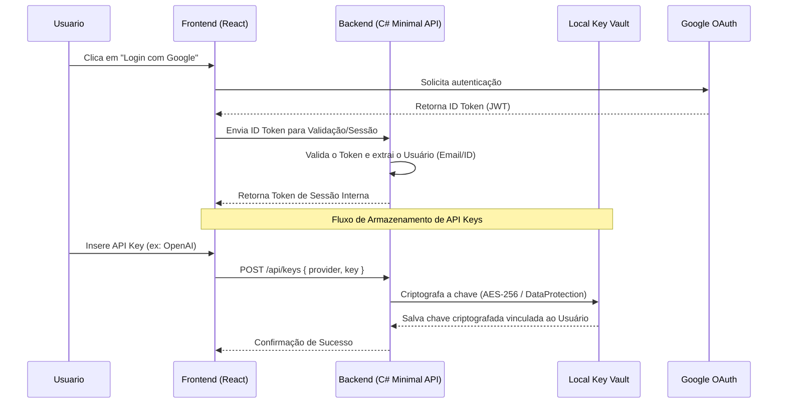

# Autenticação Google OAuth2 e Armazenamento Seguro de Chaves (Key Vault)

## Visão Geral
A fim de suportar múltiplos usuários ou pelo menos proteger as credenciais sensíveis (API Keys) de forma mais robusta, o sistema integrará Autenticação via Google OAuth2 no frontend e um mecanismo de "Local Key Vault" no backend.

## Fluxo de Autenticação e Armazenamento

## Componentes Principais

* **Frontend (`@react-oauth/google`)**: Tela de Login inicial que bloqueia o acesso às configurações até que o usuário seja autenticado.
* **Backend Validador**: Middleware em ASP.NET Core que valida tokens JWT do Google.
* **Local Key Vault**: Um serviço C# (`ILocalKeyVault`) que utiliza o `Microsoft.AspNetCore.DataProtection` (ou criptografia forte equivalente) para armazenar as chaves de forma segura (em arquivo local criptografado ou SQLite), impedindo que as chaves fiquem em texto puro (.env).

## Benefícios
* **Segurança Aprimorada**: Chaves sensíveis de IA não ficam mais legíveis no disco.
* **Rastreabilidade**: Sabemos qual usuário configurou o agente.
* **Isolamento de Contexto**: Abre portas para cada usuário ter sua própria configuração e memória no agente.
