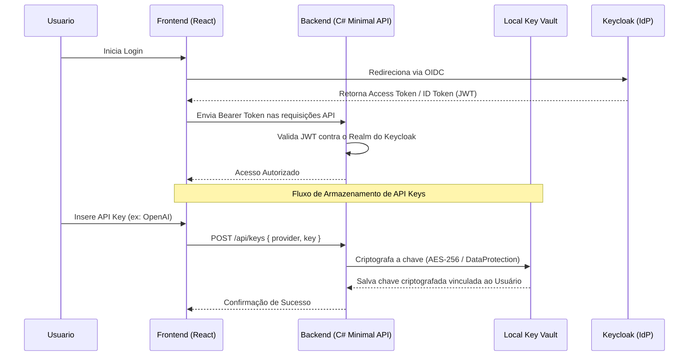

# Autenticação Keycloak OIDC e Armazenamento Seguro de Chaves (Key Vault)

## Visão Geral
A fim de suportar múltiplos usuários e uma federação de identidade mais robusta, o sistema integrará Autenticação via Keycloak (OpenID Connect) no frontend em vez de usar conexões OAuth diretas com provedores externos. Isso mantém a soberania dos dados de identidade e o mecanismo de "Local Key Vault" no C# Minimal API protegerá credenciais sensíveis.

## Fluxo de Autenticação e Armazenamento

## Componentes Principais

* **Keycloak IdP**: Novo serviço Docker fornecendo gestão de usuários e identidades independentes.
* **Frontend (`oidc-client-ts` ou `react-oidc-context`)**: Tela inicial que redireciona ao Keycloak para autenticação antes de expor a interface.
* **Backend Validador (`Microsoft.AspNetCore.Authentication.JwtBearer`)**: Middleware em ASP.NET Core que valida tokens JWT emitidos pelo Keycloak em vez de assinar os do Google de forma manual.
* **Local Key Vault**: Um serviço C# (`ILocalKeyVault`) que utiliza o `Microsoft.AspNetCore.DataProtection` (ou criptografia forte equivalente) para armazenar as chaves de forma segura (em arquivo local criptografado ou SQLite), impedindo que as chaves fiquem em texto puro (.env).

## Benefícios
* **Segurança Aprimorada**: Chaves sensíveis de IA não ficam mais legíveis no disco.
* **Rastreabilidade**: Sabemos qual usuário configurou o agente.
* **Isolamento de Contexto**: Abre portas para cada usuário ter sua própria configuração e memória no agente.
