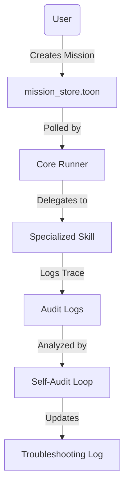

# Project Architecture

Ronaldinho-Agent follows a modular, specialist-driven architecture designed for scalability and local autonomy.

## Directory Structure

```text
Ronaldinho-Agent/
├── ronaldinho/            # Core Agent Ecosystem
│   ├── audit/             # JSONL execution logs for auditability
│   ├── config/            # State and configuration (.toon files)
│   ├── core/              # Main runner and orchestration logic
│   ├── memory/            # Long-term knowledge and context snapshots
│   ├── skills/            # Specialized Python tools (Security, Audit, Memory)
│   └── team/              # Specialist agent definitions
├── docs/                  # Technical documentation and process guides
├── logs/                  # System-level logs
├── gemini_cli.py          # Unified entry point (CLI)
└── README.md              # Project overview and quick start
```

## Key Components

### 1. The Orquestrador (Core)
The central brain that reads the `mission_store.toon` and delegates tasks to specialists. It ensures that all governance rules are followed.

### 2. Specialized Skills
Standardized Python modules that the agent can call to perform specific technical tasks:
- **SecurityTool**: Handles encryption and scrubbing.
- **MonitorTool**: Analyzes performance.
- **MemoryTool**: Manage context and sync.

### 3. The TOON Layer
All configuration and state management use **Table-Oriented Object Notation**. This makes the project's internal state highly digestible for LLMs while remaining 100% human-editable in basic text editors.

## Execution Flow


